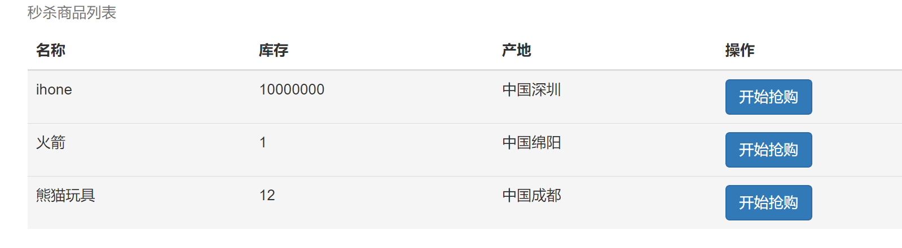
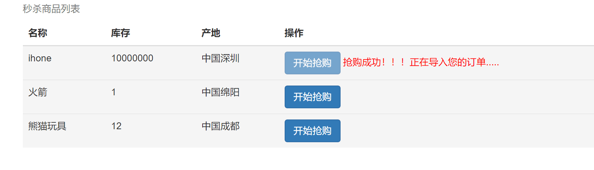
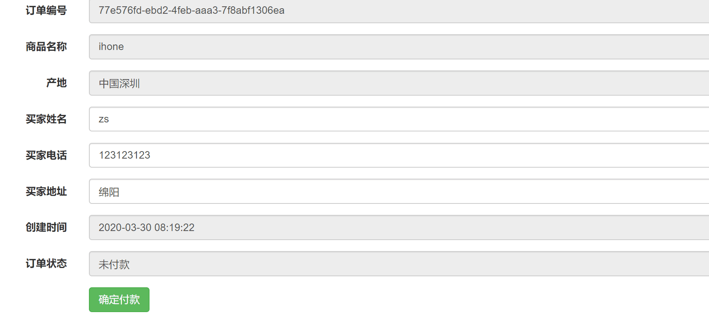
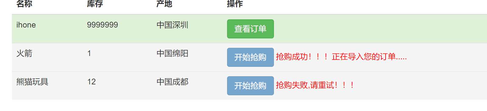

# SeckillSystem
## 项目介绍
利用redis分布式锁,Aop,SpringBoot,Mybatis实现**秒杀系统**
## 具体功能
在多线程高并发的访问情况下保证库存量不为**负数**，且正常生成订单,且在线程执行期间只能**被一个请求占用**，直到结束。用户在一定的时间内**不能重复提交请求**，避免表单的重复提交。
## 项目概览

## 项目环境：
1. springboot2.5
2. mysql-5.5
3. redis-3.0.4

